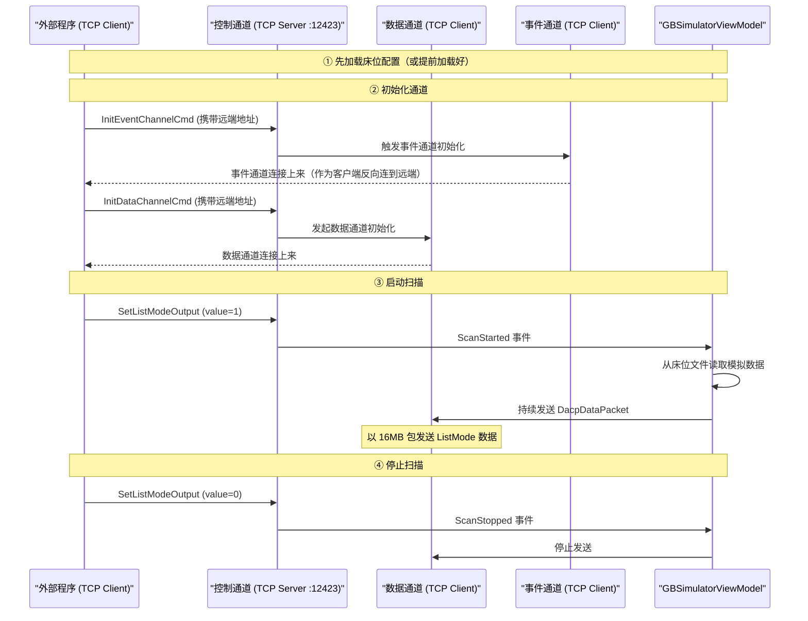

Let me查看项目 wiki 中关于通信协议和通道架构的相关文档。
让我再查看一些关键实现文件来补充细节。
## DACP 协议通信详解

### 1. DACP 是 TCP 的封装吗？

**不完全是。** DACP（Device Acquisition Control Protocol）更像是一个**构建在 TCP/UDP 之上的应用层协议**，而不是简单的 TCP 封装。它定义了自己的消息格式（命令头+命令体+应答体）、命令码体系、序列化/反序列化规则，以及消息生命周期管理。底层传输层使用 .NET Socket（TCP 或 UDP），但协议本身定义了业务层面的交互语义。

---

### 2. 通用通信流程与连接建立方式

以你的项目为例，系统启动后**同时存在 TCP 服务器和 TCP 客户端两种角色**，分别由不同的通道承担：

| 通道 | 角色 | 协议 | 端口 | 说明 |
|------|------|------|------|------|
| **控制通道** | **TCP 服务器** (Listener) | TCP | **12423** | 等待外部客户端连接，接收 DACP 命令 |
| **监控通道** | **TCP 服务器** (Listener) | TCP | **61024** | 等待监控端连接，查询系统状态 |
| **事件通道** | **TCP 客户端** | TCP | 动态 | 连接远端，上报状态事件 |
| **数据通道** | **TCP/UDP 客户端** | TCP/UDP | 动态 | 连接远端，发送 ListMode 数据 |

**你的问题：需要先启动 listener，还是调用方先连接？**

**答案是：Simulator 先启动两个 TCP Server（Listener）——控制通道（12423）和监控通道（61024），等待外部客户端来连接。** 外部调用方作为 TCP 客户端连接到这些端口后，再发送 DACP 命令。

---

### 3. 完整的连接建立与数据发送流程

```
外部程序 (TCP Client)              GB Simulator
      │                                 │
      │    ① 程序启动                    │
      │                                 ├─ 启动控制通道 Listener (端口12423)
      │                                 ├─ 启动监控通道 Listener (端口61024)
      │                                 └─ 启动 HTTP 服务 (端口5000)
      │                                 │
      │    ② TCP 连接                    │
      ├── TCP Connect :12423 ──────────>│
      │                                 │
      │    ③ 发送 DACP 命令              │
      ├── InitEventChannelCmd ─────────>│  初始化事件通道
      │                                 ├── 触发 InitEventChannelRequestReceived 事件
      │                                 └── 事件通道以 TCP 客户端方式连接远端
      │                                 │
      ├── InitDataChannelCmd ──────────>│  初始化数据通道
      │                                 ├── 触发 InitDataChannelRequestReceived 事件
      │                                 └── 数据通道以 TCP(或UDP) 客户端方式连接远端
      │                                 │
      │    ④ 设置列表模式输出 (启动扫描)    │
      ├── SetListModeOutput = 1 ───────>│  触发 ScanStarted 事件
      │                                 ├── GBSimulatorViewModel 开始发送模拟数据
      │                                 ├── 实时统计收集器开始统计
      │                                 └── 数据通道持续发送 ListMode 包到远端
      │                                 │
      │    ⑤ 停止扫描                    │
      ├── SetListModeOutput = 0 ───────>│  触发 ScanStopped 事件
      │                                 └── 停止数据发送
```

---

### 4. 如果想通知 Simulator 发送模拟数据，具体怎么做？

有两种方式：

#### 方式一：通过 DACP（推荐，模拟真实设备通信）

外部程序作为 **TCP 客户端**，连接到 Simulator 的**控制通道（端口 12423）**，依次发送以下 DACP 命令：



**对应的 DACP 命令大致流程（伪代码）：**

```csharp
// 1. 连接控制通道
var controlSocket = new TcpClient("127.0.0.1", 12423);

// 2. 初始化事件通道（携带远端IP和端口，让事件通道连过来）
SendDacpCommand(controlSocket, InitEventChannelCmd, remoteEp);
// Simulator 的事件通道会作为 TCP 客户端连到你的指定端口

// 3. 初始化数据通道（同理）
SendDacpCommand(controlSocket, InitDataChannelCmd, remoteEp);
// Simulator 的数据通道会作为 TCP 客户端连到你的指定端口

// 4. 启动扫描 - 开始发送数据
SendDacpCommand(controlSocket, SetListModeOutput, value: 1);
// Simulator 开始逐床位读取文件并通过数据通道发送 ListMode 包

// 5. 停止扫描
SendDacpCommand(controlSocket, SetListModeOutput, value: 0);
```

#### 方式二：通过 HTTP API（简化控制，不涉及底层 DACP）

Simulator 同时启动了 HTTP 服务（端口 5000），可以通过 REST API 加载配置和控制扫描（如果界面支持从 ViewModel 触发扫描）：

```bash
# 加载床位配置
curl -X POST http://localhost:5000/api/load \
  -H "Content-Type: application/json" \
  -d '{"configName":"sample_6beds"}'

# 然后在 UI 上手动启动扫描
# 或通过界面上的启动按钮触发
```

不过 HTTP API 主要提供**配置加载和患者信息更新**功能，**启动/停止扫描需要通过 DACP 命令**（控制通道）来完成。

---

### 5. 架构总结图

```
┌────────────────────────────────────────────────────────────────────┐
│                        GB Simulator 进程                            │
│                                                                    │
│  ┌────────────────────────────────────────────────────────────┐    │
│  │                   通道系统                                   │    │
│  │  ┌─────────────────┐    ┌───────────────────────────────┐  │    │
│  │  │ 控制通道 (Server)│<───│ 外部程序 (TCP Client)          │  │    │
│  │  │ 端口 12423      │    │ 发送 DACP 命令                 │  │    │
│  │  └────────┬────────┘    └───────────────────────────────┘  │    │
│  │           │                                                 │    │
│  │           │ 事件驱动                                         │    │
│  │           ▼                                                 │    │
│  │  ┌──────────────────┐    ┌──────────────────────────────┐   │    │
│  │  │ 事件通道 (Client) │───>│ 远端系统（接收状态事件）       │   │    │
│  │  └──────────────────┘    └──────────────────────────────┘   │    │
│  │  ┌──────────────────┐    ┌──────────────────────────────┐   │    │
│  │  │ 数据通道 (Client) │───>│ 远端系统（接收 ListMode 数据） │   │    │
│  │  └──────────────────┘    └──────────────────────────────┘   │    │
│  │  ┌──────────────────┐    ┌──────────────────────────────┐   │    │
│  │  │ 监控通道 (Server) │<───│ 监控端 (TCP Client)           │   │    │
│  │  │ 端口 61024       │    └──────────────────────────────┘   │    │
│  │  └──────────────────┘                                       │    │
│  └────────────────────────────────────────────────────────────┘    │
│                                                                    │
│  ┌────────────────────────────────────────────────────────────┐    │
│  │  HTTP 服务 (端口 5000)                                      │    │
│  │  POST /api/load        - 加载床位配置                       │    │
│  │  POST /api/patient-info - 更新患者信息                      │    │
│  └────────────────────────────────────────────────────────────┘    │
└────────────────────────────────────────────────────────────────────┘
```

**关键要点总结：**

1. DACP 不是在 TCP 外面简单"封装"，而是在 TCP/UDP 之上定义了**完整的应用层协议**（命令码、序列化格式、消息生命周期）
2. Simulator **先启动两个 TCP Server（Listener）**：控制通道（12423）和监控通道（61024）
3. 外部程序作为 **TCP 客户端**连接到控制通道后，通过 DACP 命令控制整个流程
4. 数据通道和事件通道是 **TCP/UDP 客户端**角色，由 Simulator 主动连接远端
5. 要触发模拟数据发送，外部程序需要依次：**连接控制通道 → InitDataChannel → SetListModeOutput=1**