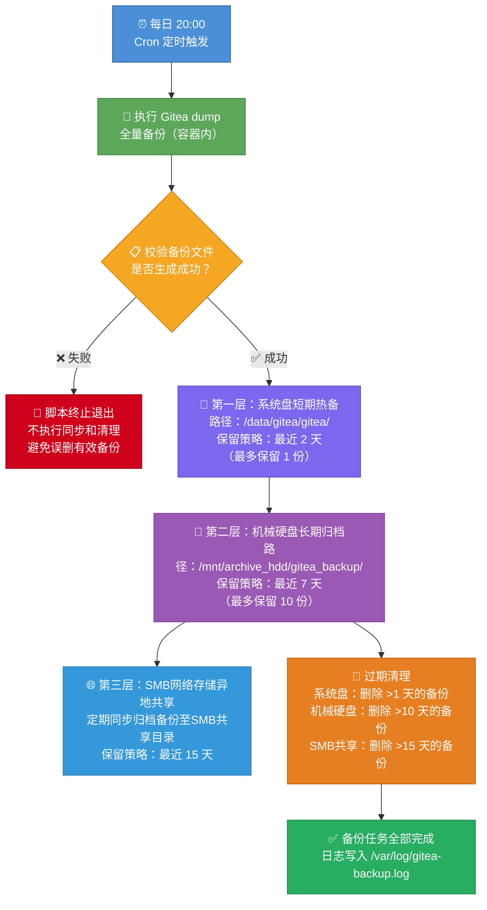

# Gitea 本地双介质灾备备份系统搭建操作手册

## 一、手册概述

### 1\.1 建设目标

为内网Gitea代码仓库搭建**双层本地灾备体系**，规避系统盘损坏、误删数据、文件丢失风险，实现全自动每日备份、自动过期清理、物理介质隔离备份，保障代码数据安全可恢复。

### 1\.2 最终备份架构（核心）

- **第一层：系统盘短期热备份**：路径 `/data/gitea/gitea/`，自动保留最近 **1天** 备份，用于快速恢复

- **第二层：独立机械硬盘长期归档备份**：路径 `/mnt/archive_hdd/gitea_backup/`，自动保留最近 **10天** 备份，物理介质隔离，作为核心灾备副本

- **第三层：SMB网络存储异地共享备份**：将归档备份定期同步至 SMB 共享目录，实现网络异地灾备，防止本地硬件整体故障导致备份全丢

### 1\.3 核心机制说明

- 备份执行：每日 20:00 自动执行全量dump备份

- 运行逻辑：容器内执行备份 → 本地生成备份文件 → 自动同步至独立机械硬盘 → 定期推送至SMB网络共享 → 分别清理过期备份

- 容错机制：备份文件生成失败则终止任务，不执行同步和清理，避免数据丢失

### 1\.4 备份流程图

以下流程图展示每日备份的完整执行过程及双介质保存策略：



**双介质备份策略一览：**

| 备份层级 | 存储介质 | 存储路径 | 保留时长 | 用途 |
|---------|---------|---------|---------|------|
| 第一层 | 系统盘（SSD/HDD） | `/data/gitea/gitea/` | **1 天**（最新 1 份） | 快速恢复，应对近期数据丢失 |
| 第二层 | 独立机械硬盘 | `/mnt/archive_hdd/gitea_backup/` | **10 天**（最多 10 份） | 物理介质隔离，长期灾备兜底 |
| 第三层 | SMB网络存储（共享目录） | `/mnt/smb_share/gitea_backup/` | **30 天**（最多 30 份） | 网络异地灾备，防止本地硬件整体故障 |

## 二、服务器环境信息

### 2\.1 基础环境

- 操作系统：Ubuntu

- Gitea 部署方式：Docker 容器部署

- Gitea 容器名：gitea

- 容器挂载映射：容器内 `/data/gitea` = 宿主机 `/data/gitea/gitea`

### 2\.2 磁盘分区规划

- `/dev/sda6`（系统盘/根分区）：28G，系统运行专用，不存放备份文件

- `/dev/sda8`（数据盘）：202G，Gitea业务数据存储、短期备份存储

- `/dev/sdb1`（新增机械硬盘）：232\.9G，独立灾备归档盘，专属存放备份副本

## 三、前期准备：新增机械硬盘挂载部署

本章节为首次搭建操作，后续无需重复执行

### 3\.1 硬件安装（安全规范）

1. 执行关机命令：`sudo shutdown now`

2. 断开服务器电源线，杜绝带电插拔，防止硬件损坏

3. 接入机械硬盘 SATA 数据线、供电线

4. 通电开机，进入系统

### 3\.2 识别新磁盘

执行命令查看所有磁盘，确认新增磁盘设备（默认 `/dev/sdb`）：

```Plain Text
lsblk
```

### 3\.3 磁盘分区操作

1. 进入磁盘分区工具：`sudo fdisk /dev/sdb`

2. 输入 `n` 新建主分区，所有参数默认回车（占用整块磁盘）

3. 提示存在NTFS残留签名，输入 `Y` 清除旧签名

4. 输入 `w` 保存分区表并退出

### 3\.4 磁盘格式化

将新建分区格式化为Linux标准ext4文件系统：

```Plain Text
sudo mkfs.ext4 /dev/sdb1
```

提示已存在ext4文件系统时，输入 `N` 取消，无需重复格式化

### 3\.5 永久挂载配置（开机自启）

1. 创建挂载目录：`sudo mkdir -p /mnt/archive_hdd`

2. 获取磁盘唯一UUID：`blkid /dev/sdb1`

3. 编辑开机挂载配置文件：`sudo nano /etc/fstab`

4. 文件末尾新增一行（替换为实际查询到的UUID）：
`UUID=xxxx-xxxx-xxxx  /mnt/archive_hdd  ext4  defaults  0  2`

5. 保存退出：Ctrl\+O → 回车 → Ctrl\+X

6. 测试挂载配置（无报错即为正常）：`sudo mount -a`

7. 验证挂载成功：`df -h /mnt/archive_hdd`

### 3\.6 创建备份归档目录

```Plain Text
sudo mkdir -p /mnt/archive_hdd/gitea_backup
sudo chmod 755 /mnt/archive_hdd/gitea_backup
```

## 四、备份脚本部署与配置

### 4\.1 创建全自动备份脚本

1. 新建脚本文件：`sudo nano /opt/gitea_backup.sh`

2. 粘贴以下定稿完整脚本：

```Plain Text
#!/bin/bash
# Gitea 自动备份脚本｜修复套娃终极版本
DATE=$(date +%Y%m%d)
BACKUP_NAME="gitea-daily-backup-${DATE}.zip"

# 【容器临时路径：不放在/data/gitea，杜绝套娃】
CONTAINER_TMP_FILE="/tmp/${BACKUP_NAME}"
# 宿主机存放临时备份目录（不要使用/data/gitea/gitea）
TMP_BACKUP_ROOT="/data/gitea_backup_tmp"
LOCAL_BACKUP_FILE="${TMP_BACKUP_ROOT}/${BACKUP_NAME}"

# 独立机械硬盘归档目录
ARCHIVE_DIR="/mnt/archive_hdd/gitea_backup"
mkdir -p "${TMP_BACKUP_ROOT}"
mkdir -p "${ARCHIVE_DIR}"

echo "====================================="
echo "开始执行 Gitea dump 备份：${BACKUP_NAME}"
echo "====================================="

# 清理上次残留临时文件
rm -f "${LOCAL_BACKUP_FILE}"

# 1.执行Gitea备份，输出到容器 /tmp
/usr/bin/docker exec -u git gitea gitea dump \
-c /data/gitea/conf/app.ini \
--skip-repository=false \
-f "${CONTAINER_TMP_FILE}"

# 2.从容器拷贝备份文件到宿主机独立目录
docker cp gitea:"${CONTAINER_TMP_FILE}" "${LOCAL_BACKUP_FILE}"
# 删除容器内临时文件
docker exec -u git gitea rm -f "${CONTAINER_TMP_FILE}"

# 3.校验备份文件是否正常生成
if [ ! -f "${LOCAL_BACKUP_FILE}" ];then
    echo "❌ ERROR：备份文件生成失败，文件不存在：${LOCAL_BACKUP_FILE}"
    exit 1
fi

echo "✅ 本地备份文件生成完成，准备复制至归档硬盘"

# 4.复制备份到机械硬盘归档目录
cp "${LOCAL_BACKUP_FILE}" "${ARCHIVE_DIR}/"
if [ $? -ne 0 ]; then
    echo "❌ ERROR：拷贝至归档硬盘失败，终止脚本，不执行清理！"
    exit 1
fi
# 统一增加读权限，方便日常校验
chmod ugo+r "${ARCHIVE_DIR}/${BACKUP_NAME}"

# 5.清理策略
# 宿主机临时备份目录：保留最近2天
echo "【清理】清理宿主机临时过期备份"
find "${TMP_BACKUP_ROOT}" -maxdepth 1 -type f -name "gitea-daily-backup-*.zip" -mtime +1 -print -delete

# 机械硬盘归档备份：保留7天
echo "【清理】清理归档硬盘过期备份"
find "${ARCHIVE_DIR}" -maxdepth 1 -type f -name "gitea-daily-backup-*.zip" -mtime +7 -print -delete

echo "✅ 全部任务完成！"
echo "临时路径：${LOCAL_BACKUP_FILE}"
echo "归档路径：${ARCHIVE_DIR}/${BACKUP_NAME}"
echo "====================================="

```

### 4\.2 赋予脚本执行权限

```Plain Text
sudo chmod +x /opt/gitea_backup.sh
```

### 4\.3 手动测试脚本（必做）

```Plain Text
sudo bash /opt/gitea_backup.sh
```

执行完成后，验证双路径备份文件生成：

```Plain Text
# 查看本地热备文件
ls -l /data/gitea_backup_tmp/gitea-daily-backup*.zip
# 查看机械硬盘灾备文件
ls -l /mnt/archive_hdd/gitea_backup/gitea-daily-backup*.zip
```

## 五、配置定时自动备份任务

### 5\.1 编辑定时任务

```Plain Text
sudo crontab -e
```

### 5\.2 添加定时规则

写入以下配置，实现**每日20:00自动执行备份，并记录日志**：

```Plain Text
0 20 * * * /bin/bash /opt/gitea_backup.sh >> /var/log/gitea-backup.log 2>&1
```

### 5\.3 校验定时任务

```Plain Text
sudo crontab -l
```

## 六、备份规则详细说明

### 6\.1 备份执行规则

- 执行周期：每日 20:00 全自动执行，无需人工干预

- 备份类型：Gitea 全量数据备份（包含仓库代码、配置、用户、附件等所有数据）

- 文件命名规则：`gitea-daily-backup-年月日.zip`，唯一不重复

### 6\.2 过期清理规则

- **系统盘本地备份**：自动删除1天前文件，最多保留1份最新备份，节省系统盘空间

- **机械硬盘归档备份**：自动删除10天前文件，长期留存多版本灾备副本

- **SMB网络共享备份**：自动删除30天前文件，异地网络灾备留存

### 6\.3 容错规则

若Gitea dump备份失败、备份文件未生成，脚本直接终止，不会执行文件同步和过期清理，避免误删有效备份。

## 七、日常运维常用命令

### 7\.1 查看备份运行日志

```Plain Text
tail -f /var/log/gitea-backup.log
```

### 7\.2 查看磁盘空间占用

```Plain Text
# 查看全盘磁盘剩余空间
df -h
# 查看归档备份目录占用大小
du -sh /mnt/archive_hdd/gitea_backup
```

### 7\.3 手动触发备份任务

```Plain Text
sudo bash /opt/gitea_backup.sh
```

## 八、数据恢复简易流程

当Gitea数据误删、损坏时，可通过备份包恢复数据：

1. 优先使用**系统盘1天内热备文件**快速恢复

2. 热备文件丢失/过期时，使用**机械硬盘10天归档备份**恢复

3. 通过 `gitea restore` 命令加载对应zip备份包恢复全量数据

## 九、风险规避与运维注意事项

- 禁止向 `/home`、根分区存放大型备份文件，避免系统盘爆满导致服务崩溃

- 机械硬盘为专属灾备盘，仅存放Gitea备份，不存储业务数据，保证介质纯净

- 定期查看日志，确认每日备份任务正常执行，避免任务静默失败

- 磁盘挂载采用UUID方式，杜绝盘符漂移导致开机挂载失败

- 如需拓展灾备，可额外增加异地推送、SMB共享推送层级（已实现，详见第十章）

## 十、第三层：SMB共享备份部署

在完成本地双介质备份后，可进一步将机械硬盘归档备份定期同步至SMB网络共享目录：\\10.10.11.31\SoftwareDev\GiteaCodeBackup，实现**三层灾备体系**，增加网络异地容灾能力。

### 10\.1 第三层备份说明

- **备份来源**：从机械硬盘归档目录 `/mnt/archive_hdd/gitea_backup/` 同步至SMB共享目录

- **同步方式**：独立同步脚本，每日定时将最新归档备份推送至SMB网络存储

- **保留策略**：SMB共享目录保留最近 **30天** 备份

- **用途**：网络异地灾备，防止本地物理设备整体故障（如服务器硬盘全部损坏）

### 10\.2 SMB共享挂载准备

#### 1. 安装CIFS挂载工具

```Plain Text
sudo apt install cifs-utils -y
```

#### 2. 创建挂载目录和凭据文件

```Plain Text
sudo mkdir -p /mnt/smb_share
```

创建SMB认证凭据文件（避免密码明文写入fstab）：

```Plain Text
sudo nano /etc/smb-credentials
```

写入以下内容（替换 `password` 为 `tengfei.ma` 账号的实际密码）：

```Plain Text
username=tengfei.ma
domain=sinogram
password=your_actual_password
```

> **注意**：域账号 `sinogram\tengfei.ma` 使用 `domain` 字段单独指定域名，避免反斜杠转义问题。`password` 必须替换为真实密码，否则挂载会报 Permission denied。

设置凭据文件权限（仅root可读）：

```Plain Text
sudo chmod 600 /etc/smb-credentials
```

#### 3. 配置开机自动挂载

编辑fstab配置文件：

```Plain Text
sudo nano /etc/fstab
```

末尾新增一行（替换实际IP地址和共享路径）：

```Plain Text
//10.10.11.31/tfs\040backup/Gitea  /mnt/smb_share  cifs  credentials=/etc/smb-credentials,iocharset=utf8,file_mode=0775,dir_mode=0775,vers=3.0,_netdev  0  0
```

> **参数说明**：
> - `credentials`：指定凭据文件路径
> - `iocharset=utf8`：支持中文文件名
> - `vers=3.0`：使用SMB 3.0协议（根据实际NAS/共享服务器版本调整）
> - `_netdev`：等待网络就绪后再挂载，避免开机挂载失败

#### 4. 创建备份子目录并测试挂载

```Plain Text
sudo mkdir -p /mnt/smb_share/gitea_backup
sudo mount -a
# 验证挂载成功
df -h /mnt/smb_share
```

### 10\.3 创建SMB同步备份脚本

1. 新建同步脚本文件：`sudo nano /opt/gitea_smb_sync.sh`

2. 粘贴以下脚本内容：

```Plain Text
#!/bin/bash
# Gitea 备份同步至SMB共享目录脚本
# 功能：将机械硬盘归档备份定期同步到SMB网络共享，实现第三层异地灾备

ARCHIVE_DIR="/mnt/archive_hdd/gitea_backup"
SMB_BACKUP_DIR="/mnt/smb_share/gitea_backup"
LOG_FILE="/var/log/gitea-backup.log"

mkdir -p "${SMB_BACKUP_DIR}"

echo "====================================="
echo "开始同步归档备份至SMB共享目录"
echo "====================================="

# 检查SMB共享是否挂载正常
if ! mountpoint -q "${SMB_BACKUP_DIR%/*}"; then
    echo "❌ ERROR：SMB共享未挂载，终止同步任务！"
    echo "请检查：mount -a 或查看 /etc/fstab 配置"
    exit 1
fi

# 同步最新备份文件到SMB共享目录
SYNC_COUNT=0
FAIL_COUNT=0

for zip_file in "${ARCHIVE_DIR}"/gitea-daily-backup-*.zip; do
    if [ ! -f "$zip_file" ]; then
        echo "⚠️ 归档目录无备份文件，跳过同步"
        break
    fi

    filename=$(basename "$zip_file")

    # 跳过已存在的文件，避免重复传输
    if [ -f "${SMB_BACKUP_DIR}/${filename}" ]; then
        echo "⏭️ 文件已存在，跳过：${filename}"
        continue
    fi

    echo "📤 同步中：${filename}"
    cp "$zip_file" "${SMB_BACKUP_DIR}/"
    if [ $? -eq 0 ]; then
        chmod ugo+r "${SMB_BACKUP_DIR}/${filename}"
        echo "✅ 同步成功：${filename}"
        SYNC_COUNT=$((SYNC_COUNT + 1))
    else
        echo "❌ 同步失败：${filename}"
        FAIL_COUNT=$((FAIL_COUNT + 1))
    fi
done

echo "📊 同步统计：成功 ${SYNC_COUNT} 个，失败 ${FAIL_COUNT} 个"

# 清理SMB共享目录中超过30天的过期备份
echo "【清理】清理SMB共享目录过期备份（>15天）"
find "${SMB_BACKUP_DIR}" -maxdepth 1 -type f -name "gitea-daily-backup-*.zip" -mtime +14 -print -delete

echo "✅ SMB同步任务完成！"
echo "====================================="
```

### 10\.4 赋予脚本执行权限

```Plain Text
sudo chmod +x /opt/gitea_smb_sync.sh
```

### 10\.5 手动测试同步脚本

```Plain Text
sudo bash /opt/gitea_smb_sync.sh
```

执行完成后验证SMB共享目录文件：

```Plain Text
ls -l /mnt/smb_share/gitea_backup/gitea-daily-backup*.zip
```

### 10\.6 配置SMB同步定时任务

#### 1. 编辑定时任务

```Plain Text
sudo crontab -e
```

#### 2. 添加定时规则

写入以下配置，每日 **21:00** 自动执行SMB同步（在20:00本地备份完成后执行）：

```Plain Text
0 21 * * * /bin/bash /opt/gitea_smb_sync.sh >> /var/log/gitea-backup.log 2>&1
```

#### 3. 校验定时任务

```Plain Text
sudo crontab -l
```

### 10\.7 SMB备份日常验证

```Plain Text
# 查看SMB同步日志
tail -50 /var/log/gitea-backup.log | grep "SMB"
# 查看SMB共享目录备份文件
ls -lh /mnt/smb_share/gitea_backup/
# 查看SMB共享目录磁盘占用
du -sh /mnt/smb_share/gitea_backup
```

## 十一、整体架构总结

本次搭建完成**三物理介质灾备体系**，区别于单一备份：

高速系统盘（短期快速恢复）\+ 独立机械硬盘（长期灾备兜底）\+ SMB网络共享（异地网络灾备），兼顾恢复效率和数据安全性，全自动无人值守运行，满足日常代码仓库数据安全运维需求。

