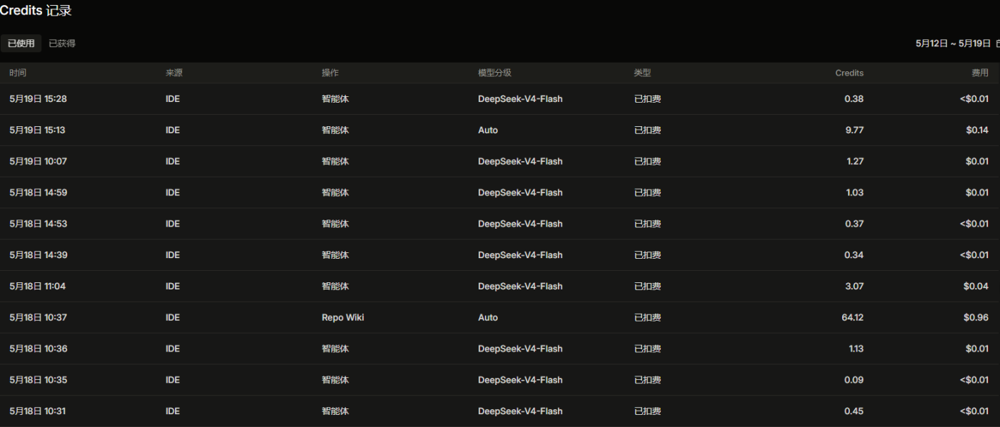

1. 使用便利性

- 上手难度：是否需要额外学习？界面是否直观？

简单，和其他常用AI编程工具操作方式和习惯等比较一致。

- 交互体验：命令输入是否自然？响应速度如何？

可以提供多种交互方式，响应速度较快，尤其是与个人免费版本比较以及API解码平台接入claude code相比有较大速度优势。

- 集成支持：是否兼容常用IDE和开发工具（如VS Code、Git）？

不能集成TFS，但是可以集成git，不能集成VS2022/2026等，日常工作需要同时开VS和Qoder。

2. 效率提升

- 代码生成：生成速度、准确率（是否需要大量修改）

生成速度和准确率受大模型影响，总体质量较高，不需要大量修改。

- 代码补全：建议的实用性（减少敲代码 vs 干扰性提示）

实用性不错。但是由于无法与常用变成工具VS集成，因此补全功能提供帮助有限。

- 调试辅助：错误检测和修复建议的有效性

目前未采用Qoder作为调试工具。

3. 成本控制

- 时间成本：任务完成时间对比（AI辅助 vs 手动编码）

提升较大，尤其是在复杂任务上，可以多agent集群工作。

- 人力成本：是否减少重复劳动？是否需要额外人工审查？

可以减少重复劳动，在一些基础编码任务上生成代码质量较高，但需要额外人工审查，可以降低重复劳动的频率。

- 经济成本：工具定价是否合理？是否有免费/试用方案？

定价比较合理，目前看到订阅是team版本的40＄/月提供每月3000credits，有使用社区版免费方案，但是token总量有限，适合低频率使用。有个人Pro版本的20＄/月提供每月2000credits，应该也足够低烈度使用。

4. 优缺点总结

- 优势（如快速原型开发、减少低级错误）

简单任务选择便宜的小模型，例如DeepSeek-V4-Flash，可以显著降低token消耗。

5. 结论

- 推荐场景（适合小型项目、新手学习、快速迭代）

基本上全场景都适用，更适合独立的，新增加的小型项目，对于已有的大型项目略有差距，但是依然能打。

- 不推荐场景（高安全性代码、复杂系统架构）

*** 6. 会议重点提炼 
05-22 AI编码工具选型与团队协作方案重点提炼
本次讨论围绕AI编码工具的选型展开，核心聚焦在功能适用性、定价模式、安全合规与团队协作方式上，最终倾向根据使用场景和管理需求选择企业版或个人版。

功能与使用体验：当前工具在复杂任务（如文档生成、多任务并行）中表现良好，能高效完成CRUD等基础编码，但需人工校验是否符合架构规范

安全与合规考量：核心代码与敏感数据不应接入公有大模型，建议私有部署；企业版承诺不训练用户数据，更符合公司安全要求；个人版虽可用，但存在数据泄露风险

团队使用建议：若团队规模小、使用频率不高，可考虑个人版报销；若需统一管理、审计与合规，推荐采购企业版；系统为中型架构，模块耦合度低，AI工具可在子模块层面有效辅助开发

成本与效率权衡：优质大模型（如DS V4 Pro等）或者选择auto/极致模式，使用成本高，建议通过摘要预处理、上下文分段等方式优化调用效率；开发人员偏好不同，工具收益因人而异，建议试点后推广